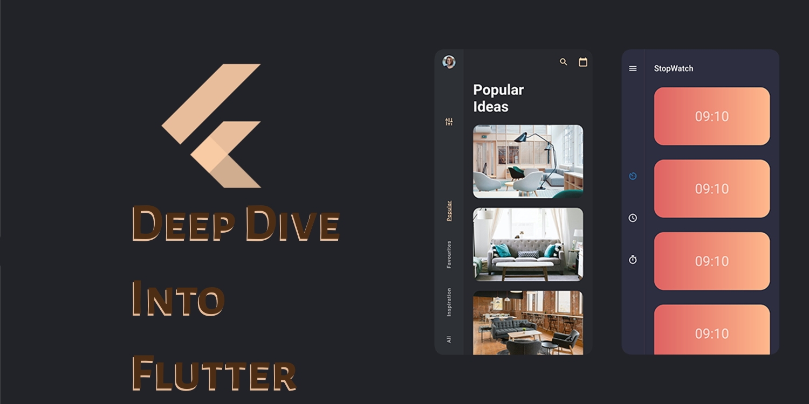

# Deep Dive Into Flutter

This my more formalized version of a Rosetta Stone of Flutter Demos to encourage you to take a deep dive into flutter to master Flutter and Dart for Front-End app development and design. It's also a starting point into my Deep Dive Into Flutter App Development Book Series.

## Code Covers

- Boilerplate, first steps in getting feedback through app exceptions, logging, zone grouping of app exceptions, etc.

- Crossplatform, first steps into the platform widgets strategy of automating the boilerplate for crossplatform UIs in flutter to avoid having to write screens twice; once for material and once for cupertino.

- ArchStateExplore, an exploration of the different arch and state strategies to state management.

## OOP and FP Covered

## Design Covered

## Articles

I work out the chapter content of each book via the formalized code and app demos here, and the articles I write using the Medium platform:

<https://fredgrott.medium.com>

## Books

As I get closer to publication dates, you will find the book website and upcoming publication dates.

## Community Resources

Flutter Community Resources <https://flutter.dev/community>

Flutter SDK <https://flutter.dev/docs/get-started/install>

Android Studio IDE <https://developer.android.com/studio>

MS's Visual Studio Code <https://code.visualstudio.com/>

Flutter Docs <https://flutter.dev/docs>

Dart Docs <https://dart.dev/guides>

Google Firebase Mobile Device TestLab <https://firebase.google.com/docs/test-lab>

AWS Device Farm <https://aws.amazon.com/device-farm/>

Code Magic CI-CD <https://codemagic.io/start/>

## About Me, Fred Grott

What happens when you redefine front-end programming and application design as the movement to teach humans with less pain and stress and move fun? Visit often, become a follower and find out. My blog is at:

<https://fredgrott.medium.com>

and you can DM me on the Keybase platform: <https://keybase.io/fredgrott>
