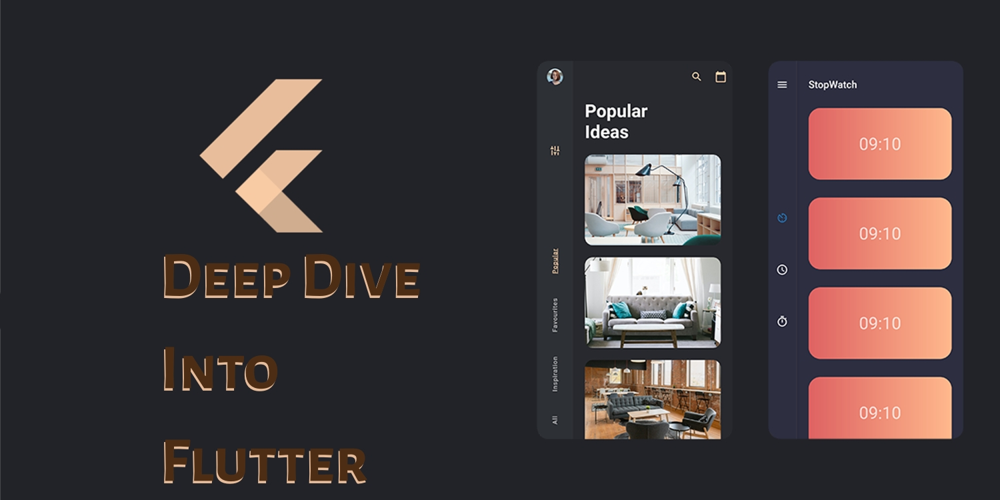

# Onion Arch

Implementation of onion layering architecture. Based on examples such as:

[Flutter Clean Arch](https://github.com/guilherme-v/flutter-clean-arch)

[Flutter Clean Arch](https://github.com/cerberodev/flutter_clean_arch)

[GetX Pattern](https://github.com/kauemurakami/getx_pattern)
